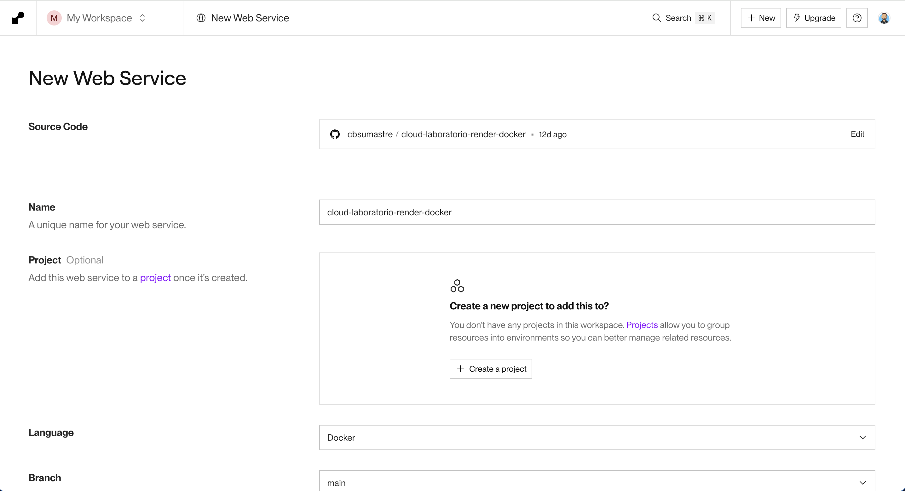
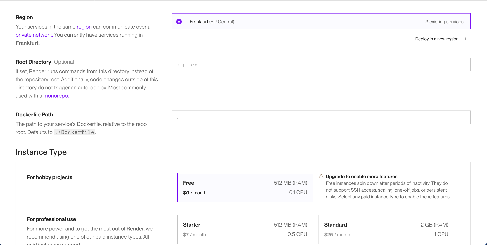
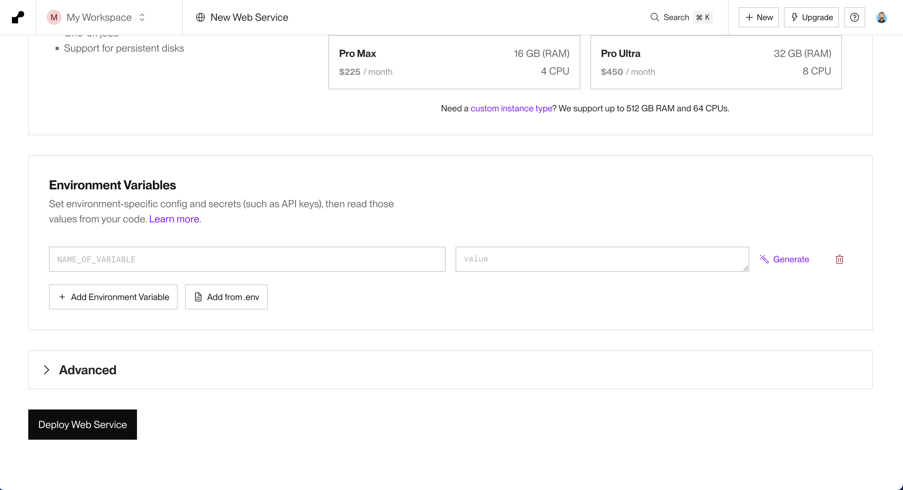

# Master Front End XVII - Módulo 7 - Cloud - Laboratorio

## Modulo Cloud - Laboratorio

### Opcional

Automatizar el despliegue de la app en Render, usando Docker.

### Para poder desplegar en Render usando Docker:

- Crear servidor (con express)

```bash
mkdir server
cd server
npm init -y
npm install express --save
```

- Crear fichero index.js dentro de server

**./server/index.js**

```js
import express from 'express'
import path from 'node:path'

const STATIC_FILES_PATH = process.env.STATIC_FILES_PATH || './app'

const app = express()
const staticFilesPath = path.resolve(process.cwd(), STATIC_FILES_PATH)
app.use('/', express.static(staticFilesPath))

app.get(/(.*)/, (_req, res) => {
  res.sendFile(path.resolve(staticFilesPath, 'index.html'))
})

const PORT = process.env.PORT || 8081
app.listen(PORT, () => {
  console.log(`App running on http://localhost:${PORT}`)
})
```

- Crear fichero Dockerfile
  **Dockerfile**

```Dockerfile
FROM node:22-alpine

RUN mkdir -p /usr/app

WORKDIR /usr/app

# COPY ./ /usr/app
COPY ./ ./

RUN npm ci
RUN npm run test
RUN npm run build

```

- Crear fichero _.dockerignore_ para que no se copien los ficheros/directorios que no queremos (como por ejemplo node_modules)

**.dockerignore**

```.dockerignore
.github
node_modules
dist
.editorconfig
.gitignore
.prettierrc.json
.env.development
.git
snapshot
Dockerfile
.gitattributes
public
.dockerignore
README.md
.vscode
.devcontainer
```

- Construir la imagen docker

```bash
docker build -t todo-app:1 .
```

- Podemos probar que la imagen se está construyendo correctamente

```bash
docker run --name todo-app-container -it todo-app:1 sh
```

- Modificar el **Dockerfile** para copiar los ficheros de dist en server/app

  [https://codewithyury.com/docker-run-vs-cmd-vs-entrypoint/](https://codewithyury.com/docker-run-vs-cmd-vs-entrypoint/)

```Dockerfile
FROM node:22-alpine

RUN mkdir -p /usr/app
WORKDIR /usr/app

# COPY ./ /usr/app
COPY ./ ./

RUN npm ci
RUN npm run test
RUN npm run clean
RUN npm run clean:server
RUN npm run build

RUN cp -r ./dist ./server/app

RUN cd server && npm ci

ENV PORT=8083
ENV STATIC_FILES_PATH="./server/app"
# https://codewithyury.com/docker-run-vs-cmd-vs-entrypoint/
CMD ["node","server/index.js"]
```

- Probar que la imagen se ha construido correctamente

```bash
docker rm -f todo-app-container
docker build -t todo-app:1 .
docker run --name todo-app-container -p 8083:8083 -d todo-app:1
```

- Modificar el **Dockerfile** para subir solo la carpeta **server** y la carpetar **server/app** con _multistage_

Pasamos de tener esta estructura

```text
|-- /usr/app
|------ config/
|------ server/
|----------- node_modules/
|----------- app/
|----------- index.js
|----------- package.json
|------ src/
```

a esta

```text
|-- /usr/app
|------ app/
|------ index.js
|------ package.json
```

**Dockerfile**

```Dockerfile
FROM node:22-alpine AS base

RUN mkdir -p /usr/app
WORKDIR /usr/app

# Prepare static files
FROM base AS build-front
COPY ./ ./
RUN npm ci
RUN npm run test
RUN npm run clean
RUN npm run clean:server
RUN npm run build

#Release
FROM base AS release
ENV STATIC_FILES_PATH="./public"
#RUN cp -r ./dist ./server/app
COPY --from=build-front /usr/app/dist ${STATIC_FILES_PATH}
# COPY ./server/package.json ./
# COPY ./server/package-lock.json ./
# COPY ./server/index.js ./
COPY --from=build-front /usr/app/server ./
RUN npm ci --omit=dev

ENV PORT=8083

# https://codewithyury.com/docker-run-vs-cmd-vs-entrypoint/
CMD ["node","index.js"]
```

- Configurar Render para que cree el Web Service usando el Dockerfile
  
  
  
